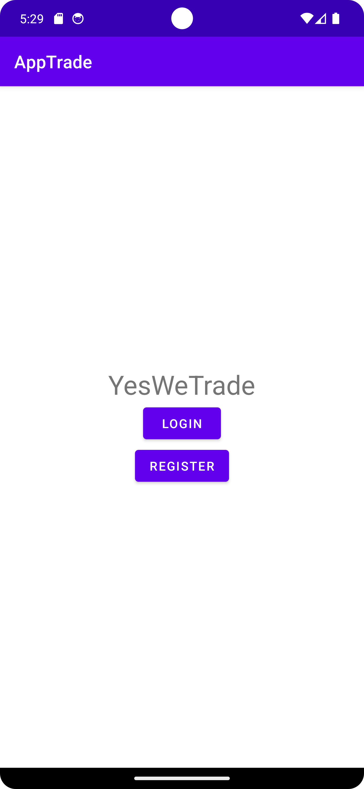
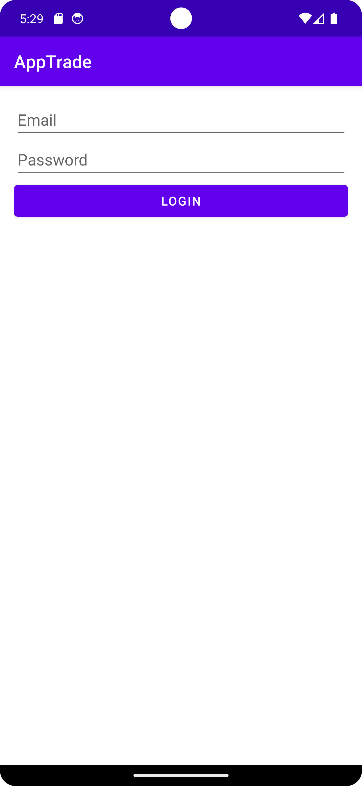
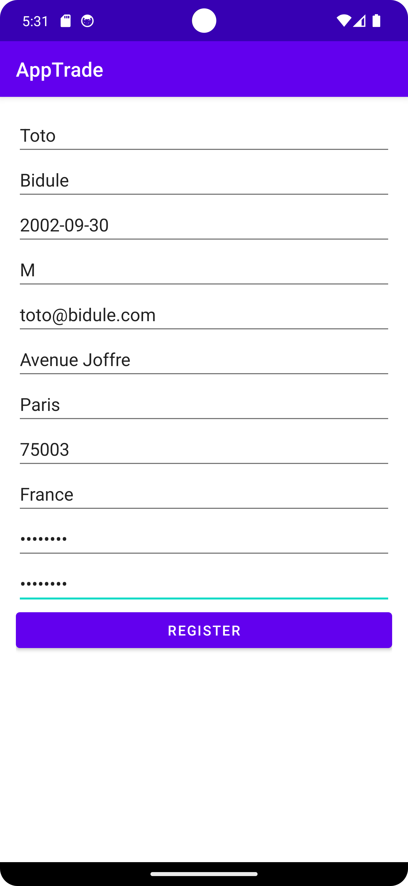
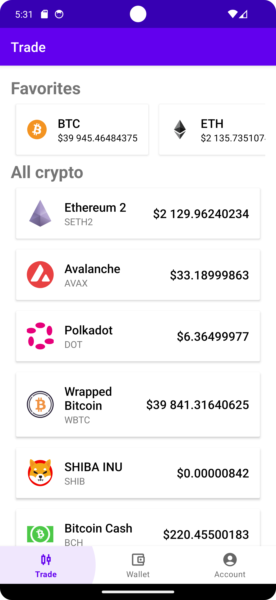
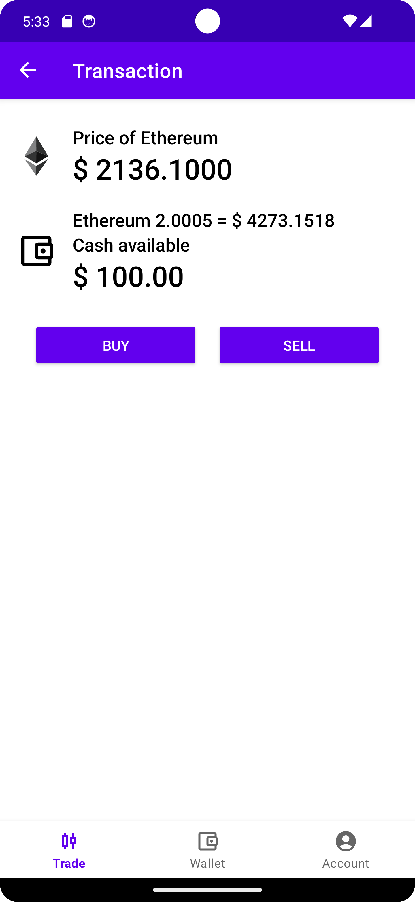
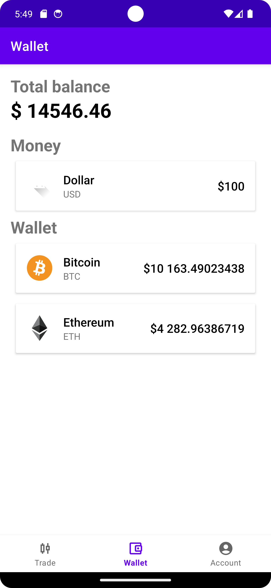
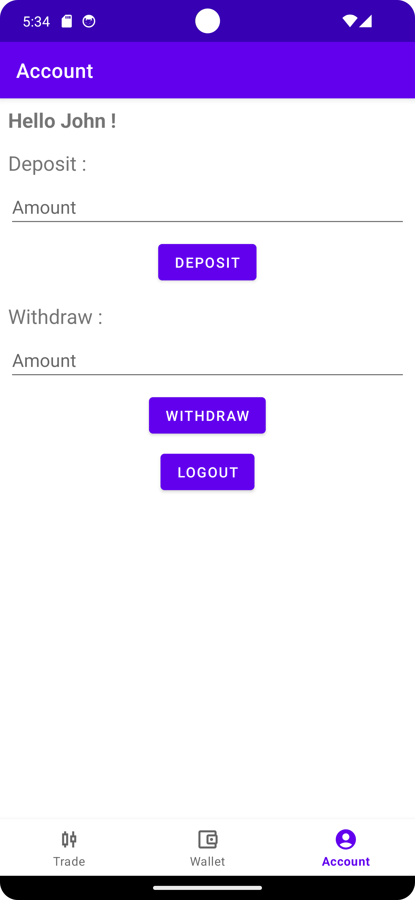

# App Trade 

## Auteurs
- LARBOULLET-MARIN Luca
- ZAIBET Sara
- ZAOUANE Thibault

## Description
Dans le cadre du module de développement d'application mobile, nous avons été amené à réaliser une application mobile. Nous avons choisi de dévellopper une application de trading. Cette application permet de suivre les cours de différentes cryptomonnaies et de passer des ordres d'achat ou de vente.

L'utilisateur peut s'inscrire et se connecter à l'application. Une fois connecté, il peut consulter la liste des différentes cryptomonnaies et consulter les cours en temps réel, ajouter des cryptomonnaies à sa liste de favoris, consulter l'historique des cours, passer des ordres d'achat ou de vente, consulter son portefeuille. Il peut également ajouter ou retirer des fonds de son portefeuille.

## Mise en place
Pour mettre en place l'application, nous avons créé une base de données en utilisant MariaDB. Nous avons ensuite créé une API en Java avec Spring Boot. De plus, pour récupérer les cours des cryptomonnaies, nous avons utilisé l'API de CoinBase. Nous avons donc relié notre API à celle de CoinBase pour récupérer les cours en temps réel.

## Déploiement API et base de données
Pour déployer l'API et la base de données, nous avons utilisé Docker. Nous avons créé un fichier docker-compose.yml pour déployer la base de données et l'API. Pour déployer l'API, nous avons créé un fichier Dockerfile. Pour déployer la base de données, nous avons utilisé l'image officielle de MariaDB.
Pour faciliter l'utilisation de l'application, nous avons également déployé l'API et la base de données sur un VPS.
Le repository de l'API est disponible à l'adresse suivante : [API Trade app](https://github.com/llarboulletmarin/app-trade-api)

## Présentation de l'application

### Connexion
L'utilisateur peut se connecter à l'application en renseignant son adresse mail et son mot de passe.
Vous pouvez utiliser les identifiants suivants pour vous connecter à l'application : 
- Adresse mail : `example@example.com`
- Mot de passe : `12345678`

### Inscription
L'utilisateur peut s'inscrire à l'application en renseignant différentes informations.

### Liste des cryptomonnaies et des favoris
L'utilisateur peut consulter la liste des différentes cryptomonnaies et consulter les cours en temps réel. Il peut également ajouter des cryptomonnaies à sa liste de favoris.

### Acheter ou vendre des cryptomonnaies
L'utilisateur peut passer des ordres d'achat ou de vente.

### Portefeuille de l'utilisateur
L'utilisateur peut consulter son portefeuille.

### Ajouter ou retirer des fonds
L'utilisateur peut ajouter ou retirer des fonds de son portefeuille.

